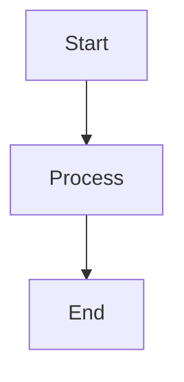

# Training System v2

A modern, full-stack training platform with **Slidev-enhanced presentation system**, built with Next.js and FastAPI.

## 🚀 Quick Start

```bash
# Start all services (recommended)
./start_all_services.sh

# Open in browser
# Frontend: http://localhost:3000
# API: http://localhost:8000
```

## ✨ Features

### 🎨 **Slidev-Enhanced Presentations**
- **Professional Themes**: Tech and Minimal themes with multiple layouts
- **Per-Slide Customization**: YAML frontmatter support for individual slide themes/layouts
- **Responsive Theme Selector**: Mobile-optimized theme and layout configuration modal
- **Math Rendering**: KaTeX support for mathematical expressions  
- **Interactive Diagrams**: Mermaid charts and flowcharts
- **Enhanced Code Highlighting**: Syntax highlighting with copy functionality
- **Slide Layouts**: title-slide, section, two-column, three-column, image-text
- **Presentation Mode**: Fullscreen presentation with keyboard navigation

### 📚 **Course Management**
- **Create & Edit**: Professional course creation with markdown support
- **ZIP Import**: Import complete courses from ZIP archives
- **Template System**: Download professional course template with Slidev features
- **Asset Management**: Serve images, videos, and documents
- **Organized Structure**: Slides, labs, and assets in separate folders

### 🔬 **Labs & Exercises**  
- **Progressive Labs**: Beginner to advanced lab exercises
- **Markdown Rendering**: Rich formatting with syntax highlighting
- **Interactive Content**: Step-by-step instructions and examples
- **Assessment Tools**: Built-in evaluation criteria

### 🏗️ **Modern Architecture**
- **Frontend**: Next.js 15+ with TypeScript and Tailwind CSS
- **Backend**: FastAPI with Python 3.12+ and async support
- **Real-time**: Live updates and responsive design
- **Production Ready**: Smart service management and monitoring

### 🆕 **Recent Improvements**
- **✅ Responsive Theme Selector**: Fixed mobile layout issues and touch-friendly interface
- **✅ Per-Slide Configuration**: YAML frontmatter parsing now correctly applies themes/layouts
- **✅ Enhanced Slide Parser**: Improved backend parsing of slide metadata and content
- **✅ Mobile-First Design**: Theme & Layout Settings modal fully responsive
- **✅ Proper Fallbacks**: Global settings with per-slide overrides working seamlessly

## 📁 Project Structure

```
training-system-v2/
├── frontend/                   # Next.js application
│   ├── src/app/               # App router pages
│   ├── src/components/        # React components  
│   └── src/lib/               # Utilities and API client
├── backend/                    # FastAPI application
│   ├── src/backend/           # Application code
│   ├── courses/               # Course content storage
│   └── course-template.zip    # Downloadable template
├── start_all_services.sh      # Start all services
├── stop_all_services.sh       # Stop all services
└── dev.sh                     # Simple development mode
```

## 🛠 Development

### Prerequisites
- **Node.js** 18+ with **yarn**
- **Python** 3.12+ with **uv**
- Modern web browser

### Service Management
```bash
# Start all services with monitoring
./start_all_services.sh

# Stop all services cleanly  
./stop_all_services.sh

# Simple development mode
./dev.sh
```

### Manual Setup
```bash
# Backend
cd backend/
uv run python run.py

# Frontend (in new terminal)
cd frontend/
yarn install
yarn dev
```

## 🎨 **Slidev Features**

### Professional Presentation System
- **Fixed 16:9 Aspect Ratio** - Consistent slide dimensions
- **Interactive Controls** - Navigation, auto-advance, fullscreen mode
- **Theme System** - Tech (dark) and Minimal (light) themes
- **Keyboard Shortcuts** - Arrow keys, spacebar, escape
- **Progress Indicators** - Slide counter and progress bar

### Enhanced Content Support

#### Per-Slide Theme and Layout Configuration
Each slide can now specify its own theme and layout using YAML frontmatter:

```markdown
---
layout: title-slide
theme: tech
---

# Your Presentation Title
## With Professional Styling

---
layout: two-column
theme: tech
---

# Content & Code Side by Side

## Left Column Content
- Professional layouts
- Multiple themes  
- Interactive elements

::right::

## Right Column Code
```javascript
function example() {
  console.log("Enhanced code highlighting");
  return "Professional presentations";
}
```

---
layout: section
theme: minimal
---

# Math & Diagrams

## Mathematical Expressions
Inline: $E = mc^2$ and block:

$$
\int_{-\infty}^{\infty} e^{-x^2} dx = \sqrt{\pi}
$$

## Mermaid Diagrams

```

#### Available Themes and Layouts
- **Themes**: `tech` (dark gradient), `minimal` (clean light)
- **Layouts**: `default`, `title-slide`, `section`, `two-column`, `three-column`, `image-text`
- **Global Settings**: Use Theme & Layout Settings modal to set defaults
- **Per-Slide Override**: YAML frontmatter takes precedence over global settings

## 📚 Documentation

- **[User Guide](USER_GUIDE.md)** - Complete user documentation
- **[API Documentation](API_DOCUMENTATION.md)** - Comprehensive API reference
- **[CLAUDE.md](../CLAUDE.md)** - Developer documentation
- **Interactive API Docs**: http://localhost:8000/docs

## 🎯 Key Features

### ZIP Course Import
Import complete courses with organized folder structure:
```
course-package/
├── config.json              # Course metadata
├── slides/slides.md          # Presentation content  
├── labs/lab-*.md            # Lab exercises
└── assets/                   # Images, videos, docs
```

### Template Course System
- Professional course template with 11 slides
- 3 progressive lab exercises (basic → advanced)
- Complete asset framework and documentation
- Download via: `/api/courses/template/download`

### Labs Management
- Progressive difficulty structure
- Markdown rendering with syntax highlighting
- Assessment criteria and troubleshooting guides
- Real-world project examples

### Asset Serving
- Static file serving for course materials
- Automatic MIME type detection
- Security validation and path protection
- Support for images, videos, documents

## 🔧 Technology Stack

### Frontend
- **Next.js 15+** - React framework with App Router
- **TypeScript** - Type safety and developer experience
- **Tailwind CSS** - Utility-first CSS framework
- **Heroicons** - Beautiful SVG icons
- **Mermaid** - Interactive diagrams and flowcharts
- **Custom Theme System** - Professional presentation themes

### Backend  
- **FastAPI** - Modern Python web framework
- **Python 3.12+** - Latest Python features
- **uv** - Fast Python package manager
- **Markdown** - Content processing with frontmatter support

### Presentation Features
- **Slidev-Inspired** - Professional slide layouts and themes
- **Math Support** - Mathematical expressions (KaTeX ready)
- **Code Highlighting** - Enhanced syntax highlighting
- **Interactive Elements** - Clickable components and navigation
- **Responsive Design** - Mobile-friendly presentations

### Development Tools
- **yarn** - Frontend package management
- **uv** - Python environment management
- **Service Scripts** - Smart process management
- **Hot Reload** - Live development updates

## 📖 Usage Examples

### Creating a Course
```bash
curl -X POST http://localhost:8000/api/courses \
  -H "Content-Type: application/json" \
  -d '{
    "title": "My Course", 
    "description": "Learn awesome things",
    "level": "Beginner"
  }'
```

### Importing ZIP Course
```bash
curl -X POST http://localhost:8000/api/courses/import \
  -F "file=@my-course.zip"
```

### Download Template
```bash
curl -O http://localhost:8000/api/courses/template/download
```

## 🚦 Service Management

### Automatic Features
- **Port Conflict Resolution** - Handles busy ports automatically
- **Health Monitoring** - Restarts failed services
- **Process Management** - Clean shutdown and startup
- **Log Management** - Centralized logging system

### Service URLs
- **Frontend**: http://localhost:3000
- **Backend API**: http://localhost:8000  
- **API Documentation**: http://localhost:8000/docs
- **Redoc**: http://localhost:8000/redoc

## 🐛 Troubleshooting

### Common Issues
- **Port conflicts**: Scripts automatically handle port 3000/8000 conflicts
- **Dependencies**: Use `yarn install` for frontend, `uv sync` for backend
- **Services not starting**: Try `./stop_all_services.sh` then `./start_all_services.sh`

### Getting Help
- Check service logs: `backend.log` and `frontend.log`
- View API documentation: http://localhost:8000/docs
- Review user guide: [USER_GUIDE.md](USER_GUIDE.md)

## 🎨 Course Creation Workflow

1. **Download Template**: Get the professional course template
2. **Customize Content**: Edit slides, labs, and assets
3. **Package as ZIP**: Create organized course structure
4. **Import Course**: Use ZIP import feature
5. **Test & Refine**: Review and improve content
6. **Publish**: Share with learners

## 🔄 Migration from Legacy

The system maintains backward compatibility while offering new features:
- Import existing markdown courses
- Upgrade to organized folder structure
- Enhanced asset management
- Modern UI and API

## 📈 Performance

### Optimizations
- Fast course loading with caching
- Efficient asset serving
- Responsive UI with lazy loading
- Smart service management

### Scalability
- Async Python backend
- Component-based frontend architecture
- File-based content storage
- RESTful API design

## 🛡 Security

### Features
- File upload validation
- Path traversal prevention
- CORS configuration
- ZIP extraction security

### Best Practices
- Validate all file uploads
- Sanitize user content
- Use secure file paths
- Regular dependency updates

## 🚀 Production Deployment

The system is designed for easy deployment:
- Docker-ready configuration
- Environment-based settings
- Health check endpoints
- Graceful service management

## 📝 Contributing

### Development Setup
1. Fork the repository
2. Create a feature branch
3. Make your changes
4. Test with provided scripts
5. Submit a pull request

### Guidelines
- Follow TypeScript best practices
- Use provided service scripts
- Update documentation as needed
- Test all course import functionality

---

**Ready to create amazing training content?** Start with `./start_all_services.sh` and open http://localhost:3000!