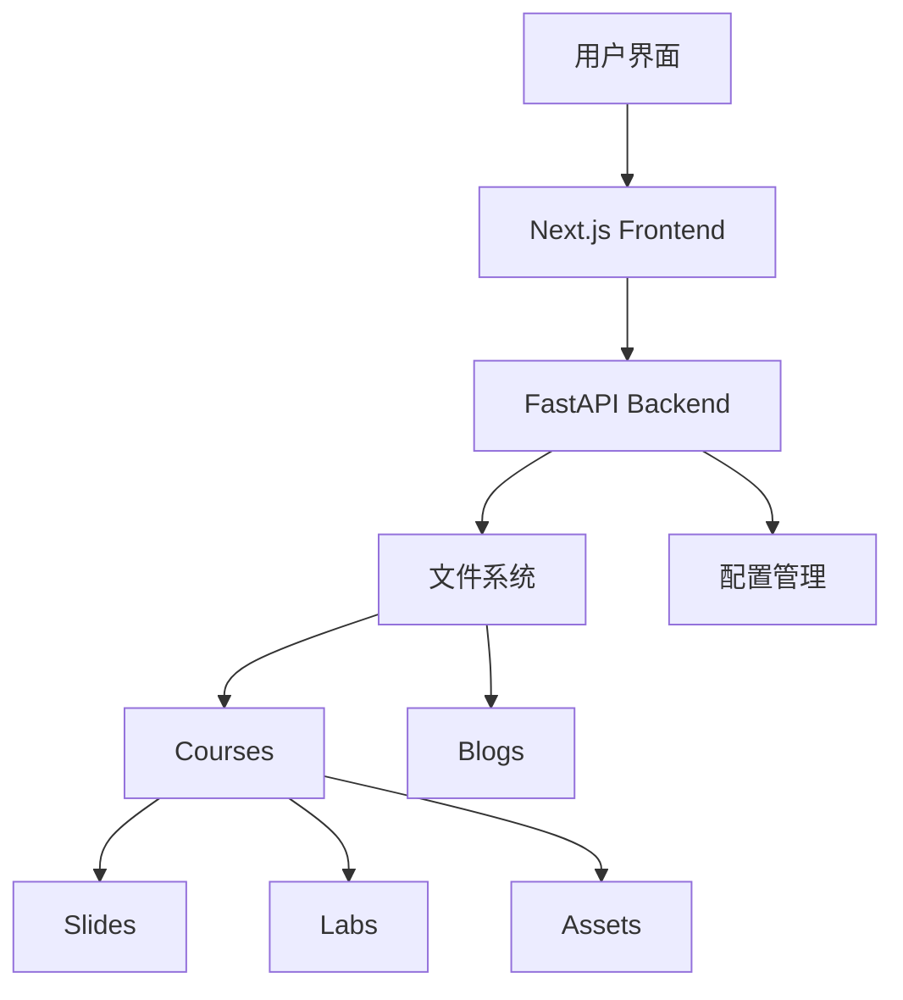

# 我的第一篇博客

欢迎来到 **Knowledge Center**！这是一个功能强大的知识管理和培训平台，专为现代企业和教育机构设计。

## 平台介绍

Knowledge Center 提供了一系列先进的功能，帮助您创建、管理和分享知识内容：

### 🎯 核心功能

- **课程管理**：创建和组织培训课程
- **幻灯片演示**：交互式presentation体验
- **实验室练习**：实践性学习内容
- **资源管理**：统一的文件存储和管理
- **博客系统**：知识分享和交流平台

### 💡 技术特性

我们的平台采用现代化的技术栈：

```javascript
// 前端技术
const frontend = {
  framework: "Next.js 15",
  language: "TypeScript", 
  styling: "Tailwind CSS",
  ui: "React 19"
};

// 后端技术
const backend = {
  framework: "FastAPI",
  language: "Python 3.8+",
  server: "uvicorn"
};
```

### 📚 如何开始

1. **创建课程**：点击"Create Course"按钮
2. **上传内容**：支持Markdown格式的slides和labs
3. **管理资源**：上传图片、文档等支持材料
4. **开始演示**：一键进入presentation模式

### 🚀 最新功能

#### 文件上传系统
- 支持Markdown文件上传
- 自动格式验证
- 重复文件智能处理

#### 现代化界面
- 响应式设计
- 确认弹窗组件
- Toast通知系统
- 统一的UI风格

#### 编辑功能
- 实时预览
- UUID临时文件系统
- 自动保存
- 版本控制

## 用户体验

### 简单易用

Knowledge Center 的设计理念是"**简单而强大**"。我们相信复杂的功能不应该意味着复杂的操作。

> 📝 **设计原则**  
> 我们始终坚持用户友好的设计，确保每个功能都直观易懂，让您专注于内容创作而非工具学习。

### 性能优化

- ⚡ **快速加载**：优化的资源加载策略
- 📱 **移动友好**：完全响应式设计
- 🔒 **安全可靠**：现代化的安全措施
- 🎨 **美观界面**：精心设计的用户界面

## 技术架构



## 支持的格式

| 内容类型 | 支持格式 | 用途 |
|---------|----------|------|
| 幻灯片 | `.md` | 课程演示 |
| 实验 | `.md` | 实践练习 |
| 博客 | `.md` | 知识分享 |
| 资源 | 全格式 | 支持材料 |

## 最佳实践

### 📝 内容创作

1. **使用Markdown语法**：确保内容格式化正确
2. **添加元数据**：为内容添加标题、描述等信息
3. **组织结构**：使用清晰的标题层次
4. **测试预览**：发布前使用预览功能检查

### 🎨 设计建议

- 保持内容简洁明了
- 使用适当的图片和图表
- 注意颜色对比度
- 确保移动设备兼容性

## 联系我们

如果您在使用过程中遇到任何问题，或者有改进建议，请随时联系我们：

- 📧 **邮箱**：support@knowledgecenter.com
- 💬 **讨论**：GitHub Issues
- 📖 **文档**：查看完整文档

---

感谢您选择 Knowledge Center！让我们一起创建更好的学习体验。

**最后更新**：2024年9月12日  
**作者**：知识中心团队