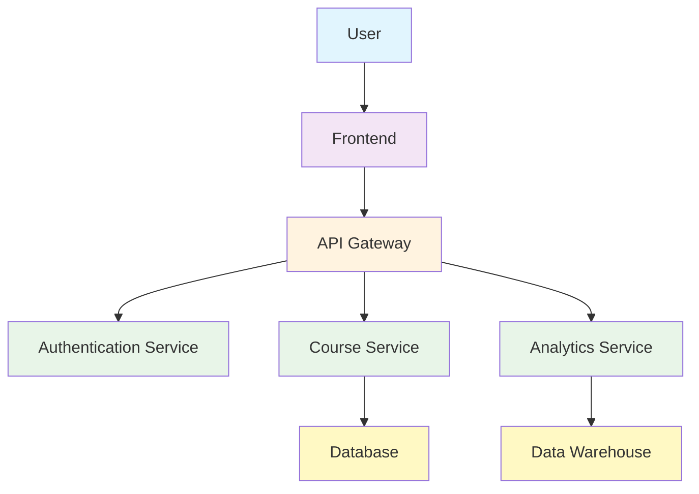
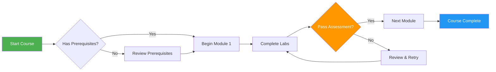
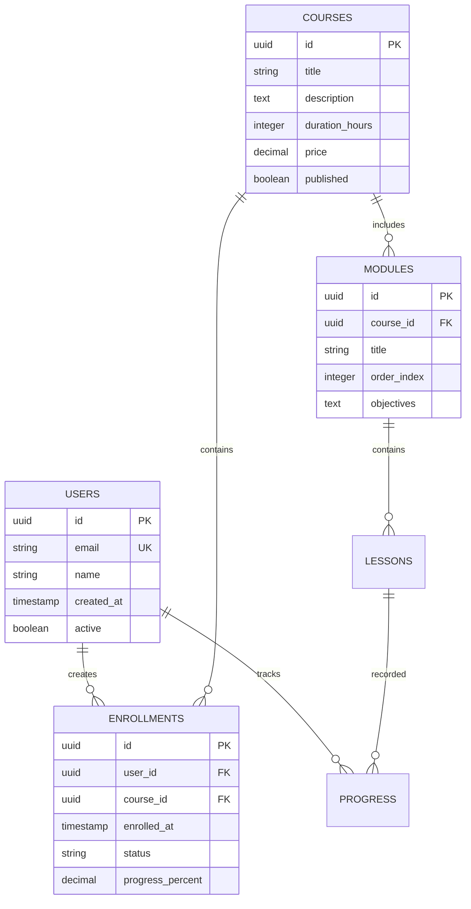

# Welcome to Slidev-Enhanced Training

## A Modern Presentation Framework with Interactive Features

Transform your learning experience with math, diagrams, and interactive elements

---
layout: intro
---

# Course Objectives

By the end of this course, you will master:

## Learning Outcomes:
- ✅ **Mathematical Concepts** - Using KaTeX for beautiful equations
- ✅ **Visual Diagrams** - Creating flowcharts with Mermaid  
- ✅ **Code Examples** - Syntax-highlighted programming samples
- ✅ **Interactive Elements** - Engaging presentation features

## Prerequisites:
- Basic knowledge of the subject area
- Access to required tools and software  
- Enthusiasm for learning with modern tools! 🚀

---
layout: section
---

# Mathematics in Action

---

# Mathematical Expressions

## Inline Math
Here's an inline equation: $E = mc^2$ representing Einstein's famous formula.

The quadratic formula is: $x = \frac{-b \pm \sqrt{b^2 - 4ac}}{2a}$

## Block Math
Here's a more complex equation displayed as a block:

$$
\int_{-\infty}^{\infty} e^{-x^2} dx = \sqrt{\pi}
$$

### Statistical Formulas
The standard deviation formula:

$$
\sigma = \sqrt{\frac{1}{N} \sum_{i=1}^{N} (x_i - \mu)^2}
$$

---
layout: section
---

# Visual Diagrams

---

# System Architecture Diagram



This diagram shows how our training system components interact with each other.

---

# Process Flow



---
layout: section
---

# Code Examples

---

# JavaScript Example

Here's a modern JavaScript function with advanced syntax highlighting:

```javascript
// Enhanced async function with error handling
async function fetchCourseData(courseId) {
  try {
    const response = await fetch(`/api/courses/${courseId}`, {
      method: 'GET',
      headers: {
        'Content-Type': 'application/json',
        'Authorization': `Bearer ${getAuthToken()}`
      }
    });
    
    if (!response.ok) {
      throw new Error(`HTTP ${response.status}: ${response.statusText}`);
    }
    
    const data = await response.json();
    console.log('Course data loaded:', data.title);
    
    return {
      id: data.id,
      title: data.title,
      modules: data.modules.map(module => ({
        name: module.name,
        duration: module.estimatedTime,
        completed: module.progress === 100
      }))
    };
  } catch (error) {
    console.error('Failed to fetch course data:', error);
    throw error;
  }
}
```

---

# Python Data Analysis

```python
import pandas as pd
import matplotlib.pyplot as plt
import numpy as np

# Load and analyze course completion data
def analyze_course_performance(file_path):
    """
    Analyze student performance data and generate insights
    """
    # Load data
    df = pd.read_csv(file_path)
    
    # Calculate completion rates
    completion_rate = df['completed'].mean() * 100
    avg_score = df['final_score'].mean()
    
    # Create visualization
    fig, (ax1, ax2) = plt.subplots(1, 2, figsize=(12, 5))
    
    # Completion rate by module
    module_completion = df.groupby('module')['completed'].mean()
    ax1.bar(module_completion.index, module_completion.values)
    ax1.set_title('Completion Rate by Module')
    ax1.set_ylabel('Completion Rate (%)')
    
    # Score distribution
    ax2.hist(df['final_score'], bins=20, alpha=0.7, color='skyblue')
    ax2.set_title('Score Distribution')
    ax2.set_xlabel('Final Score')
    ax2.set_ylabel('Frequency')
    
    plt.tight_layout()
    plt.show()
    
    return {
        'completion_rate': completion_rate,
        'average_score': avg_score,
        'top_performers': df[df['final_score'] > 90]['student_id'].tolist()
    }
```

---
layout: two-cols
---

# Configuration Example

## YAML Configuration

```yaml
# Course configuration
course:
  name: "Advanced Web Development"
  version: "2.1.0"
  duration: "40 hours"
  
modules:
  - name: "Frontend Frameworks"
    technologies: [React, Vue, Angular]
    labs: 5
    
  - name: "Backend APIs"
    technologies: [Node.js, Python, Go]
    labs: 7
    
  - name: "DevOps & Deployment"
    technologies: [Docker, K8s, AWS]
    labs: 4

assessment:
  passing_score: 75
  retries_allowed: 3
  time_limit: "2 hours"
```

::right::

## JSON API Response

```json
{
  "courseId": "web-dev-advanced",
  "status": "active",
  "enrollment": {
    "current": 245,
    "capacity": 300,
    "waitlist": 15
  },
  "metrics": {
    "completion_rate": 0.87,
    "average_score": 82.4,
    "satisfaction": 4.6
  },
  "schedule": {
    "start_date": "2024-02-15",
    "end_date": "2024-04-30",
    "sessions_per_week": 2
  },
  "prerequisites": [
    "basic-html-css",
    "javascript-fundamentals"
  ]
}
```

---
layout: section
---

# Interactive Features

---
layout: center
---

# Quick Reference Commands

## Essential Git Commands
```bash
# Initialize repository and make first commit
git init
git add .
git commit -m "Initial commit"
git branch -M main
git remote add origin <repository-url>
git push -u origin main

# Feature development workflow  
git checkout -b feature/new-functionality
git add .
git commit -m "Add new functionality"
git push origin feature/new-functionality
```

## Docker Containerization
```dockerfile
FROM node:18-alpine
WORKDIR /app
COPY package*.json ./
RUN npm ci --only=production
COPY . .
EXPOSE 3000
CMD ["npm", "start"]
```

---

# Database Schema



---
layout: section
---

# Assessment & Next Steps

---

# How You'll Be Evaluated

## Assessment Methods:
- **🔬 Practical Labs** (60%): Hands-on exercises with real code
- **🧠 Knowledge Checks** (25%): Understanding key concepts  
- **🚀 Final Project** (15%): Comprehensive application

## Grading Formula:
Final score calculation:
$$
\text{Final Score} = 0.6 \times \text{Labs} + 0.25 \times \text{Quizzes} + 0.15 \times \text{Project}
$$

### Next Steps:
1. ✅ Complete all lab exercises
2. 📚 Review course materials with math and diagrams
3. 🔍 Explore additional Slidev resources
4. 🎯 Consider advanced courses
5. 🤝 Join our developer community!

---
layout: center
---

# Thank You!

## Key Takeaways:
- 🧮 **Mathematical Expressions** - Beautiful LaTeX rendering with KaTeX
- 📊 **Visual Diagrams** - Interactive Mermaid charts and flows  
- 💻 **Enhanced Code** - Syntax highlighting with copy functionality
- 🎨 **Modern Layouts** - Professional slide designs and themes

## What's Next?
- Apply your skills in real projects
- Create presentations with Slidev features
- Share knowledge with the community
- Continue learning and growing

**Keep building amazing things!** 🚀

### Resources:
- 📖 [Slidev Documentation](https://sli.dev)
- 🧮 [KaTeX Math Guide](https://katex.org)
- 📊 [Mermaid Diagram Syntax](https://mermaid.js.org)
- 💼 [Course Repository](#)

---
layout: center
---

# Appendix: Feature Reference

## Mathematical Notation
- **Inline Math**: `$E = mc^2$` → $E = mc^2$
- **Block Math**: `$$\int x dx$$` → $$\int x dx$$

## Diagram Types
```text
graph, flowchart, sequence, class, 
state, entity-relationship, user-journey,
gantt, pie, timeline, gitgraph
```

## Layout Options
```yaml
layouts: [default, center, cover, intro, 
         section, two-cols, three-cols, 
         image-right, quote, statement]
```

**Remember**: This enhanced template showcases the power of modern presentation tools!